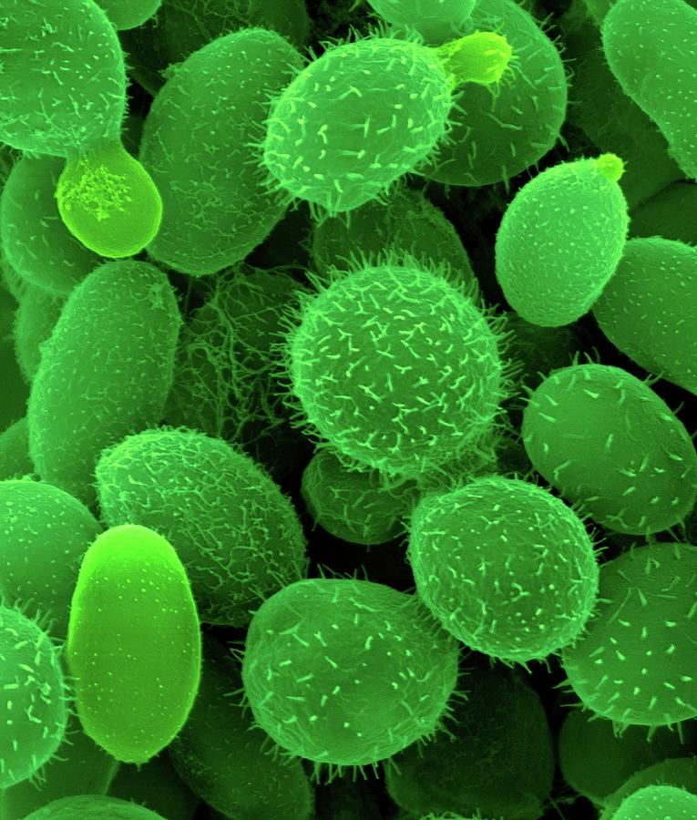
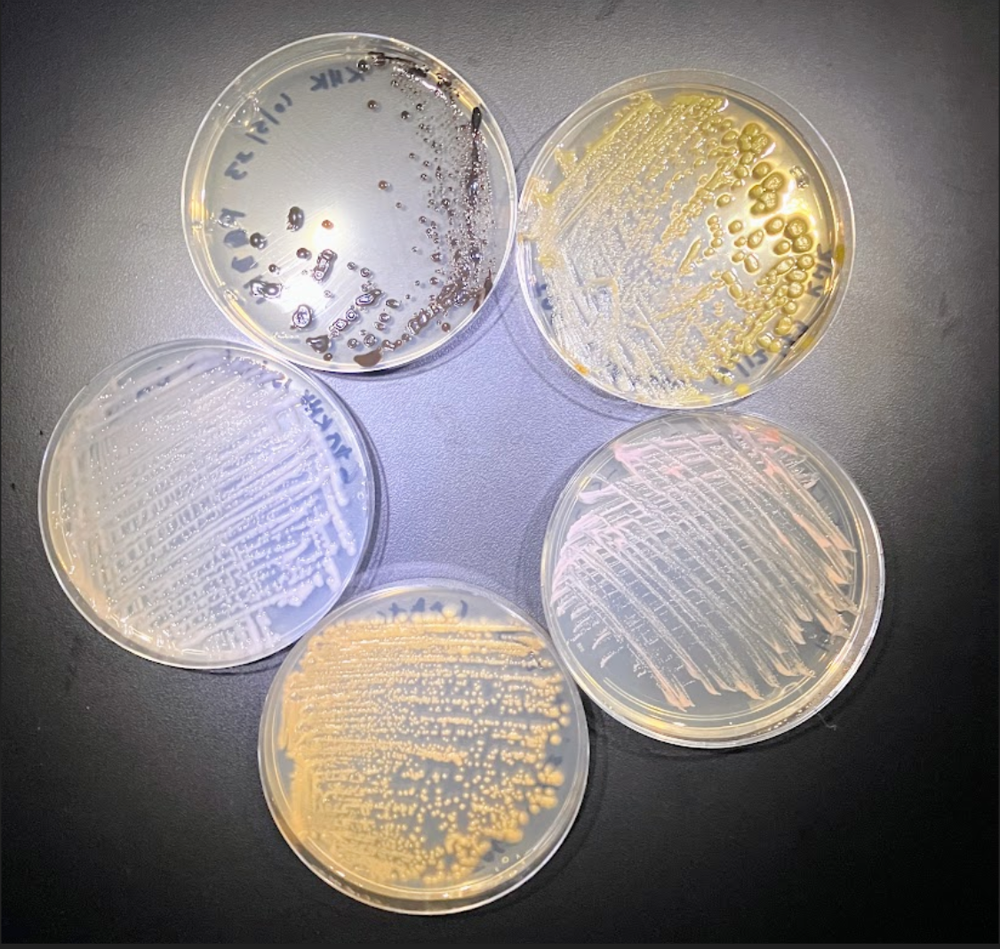
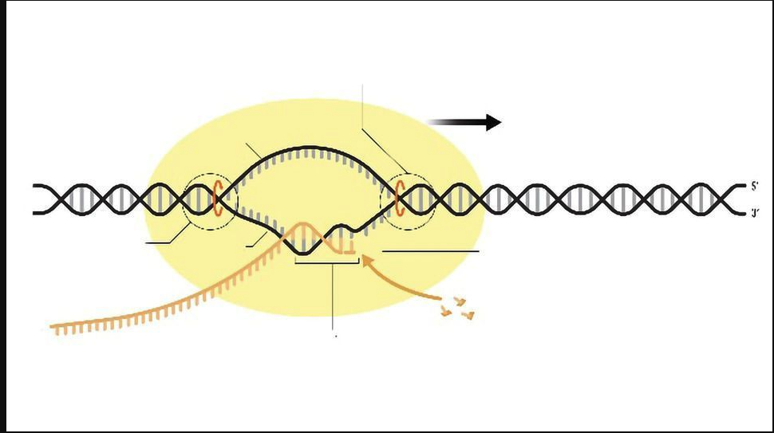

# MCBL121 Winter 2024 Lectures

-   This is a repository of lectures related to MCBL121 Discussion.
-   Check the description for links to each lecture.

### [Lecture one](https://cluster.hpcc.ucr.edu/~kkell060/lectures/lecture_1.html#1)

{width="220"}

### [Lecture two](https://cluster.hpcc.ucr.edu/~kkell060/lectures/lecture_2.html#1)

{width="249" height="234"}

### [Lecture three](https://cluster.hpcc.ucr.edu/~kkell060/lectures/lecture_3.html#1)

{width="249" height="234"}
